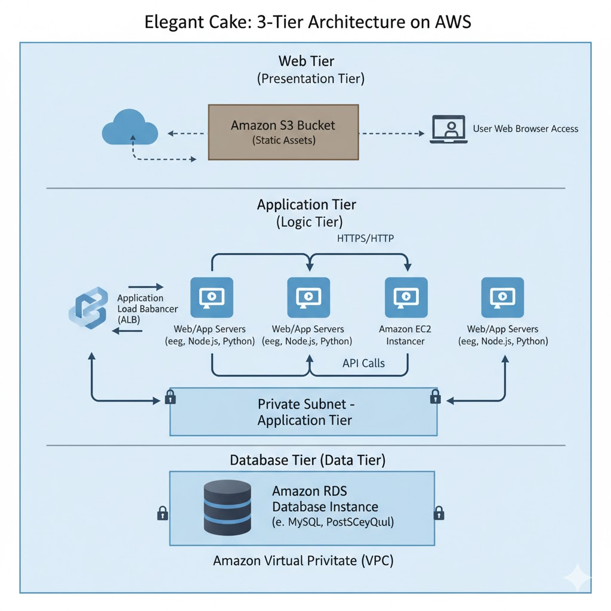

# Elegant Cakes - 3-Tier E-Commerce Platform on AWS

Elegant-Cakes is a cloud-native e-commerce application for gourmet desserts, built on AWS for high availability and scalability.
It uses AWS services—including S3, Lambda, RDS, and CloudFront—to deliver secure uploads, real-time image processing, and global content delivery.

# 🚀 Architecture



## ✨ Key Features

✅ **E-Commerce Functionality**
- Product catalog with category filtering
- Shopping cart with real-time updates
- Smooth slide-in notifications
- Session-based cart management

✅ **AWS 3-Tier Architecture**
- **Presentation Tier**: EJS templates + S3 static assets (CSS, JS, images)
- **Application Tier**: Node.js Express on EC2
- **Data Tier**: MySQL RDS in private subnet

✅ **Infrastructure**
- Load balancing with AWS Application Load Balancer (ALB)
- HTTPS encryption (ACM certificate)
- Multi-AZ VPC with public/private subnets
- Security groups with least privilege access
- S3 bucket for static asset delivery

✅ **DevOps & Automation**
- Complete Infrastructure-as-Code with Terraform
- Automated EC2 setup with cloud-init user-data
- PM2 process manager for Node.js
- Environment-based configuration (.env)

## 🏗️ Architecture Overview

```
┌─────────────────────────────────────────────────────────┐
│                    Internet                             │
└────────────────────────┬────────────────────────────────┘
                         │ HTTPS (Port 443)
                         │
        ┌────────────────▼────────────────┐
        │   AWS Application Load Balancer │
        │   (ALB with SSL Certificate)    │
        └────────────────┬────────────────┘
                         │ HTTP (Port 3000)
        ┌────────────────▼────────────────────────────┐
        │          VPC (10.0.0.0/16)                  │
        │                                              │
        │  ┌────────────────────────────────────────┐ │
        │  │  Public Subnets (Multi-AZ)             │ │
        │  │  ┌──────────────────────────────────┐  │ │
        │  │  │ EC2 Instance (Node.js App)       │  │ │
        │  │  │ - Express Server                 │  │ │
        │  │  │ - PM2 Process Manager            │  │ │
        │  │  └──────────────────────────────────┘  │ │
        │  └────────────────────────────────────────┘ │
        │                     │                        │
        │   ┌─────────────────┼─────────────────┐     │
        │   │                 │                 │     │
        │   ▼                 ▼                 ▼     │
        │ ┌──────────┐   ┌────────────┐   ┌────────┐ │
        │ │  MySQL   │   │ S3 Bucket  │   │ IAM    │ │
        │ │ RDS      │   │ (Assets)   │   │ Roles  │ │
        │ │(Private) │   │            │   │        │ │
        │ └──────────┘   └────────────┘   └────────┘ │
        │                                              │
        └──────────────────────────────────────────────┘
```

## 🛠️ Tech Stack

| Layer | Technology |
|-------|-----------|
| **Frontend** | EJS, HTML, CSS, JavaScript |
| **Backend** | Node.js, Express.js |
| **Database** | MySQL 8.0 (AWS RDS) |
| **Infrastructure** | AWS (EC2, RDS, S3, ALB, VPC) |
| **IaC** | Terraform |
| **Process Manager** | PM2 |
| **Asset Hosting** | AWS S3 |

## 📂 Project Structure

```
elegant-cakeshop/
├── terraform/                 # Infrastructure-as-Code
│   ├── main.tf               # EC2 & ALB
│   ├── rds.tf                # Database
│   ├── s3.tf                 # Assets
│   ├── variables.tf
│   ├── terraform.tfvars      # Your values
│   └── user-data.sh          # EC2 setup
│
├── app/
│   ├── server.js             # Express entry point
│   ├── package.json
│   ├── routes/               # API routes
│   ├── views/                # EJS templates
│   ├── public/               # Static files
│   └── config/               # Database config
│
├── schema.sql                # Database schema
├── README.md                 # This file
└── DEPLOYMENT.md             # Deployment guide
```

## 🚀 Quick Start

```bash
# 1. Clone repository
git clone https://github.com/abrarsyedd/elegant-cakeshop.git
cd elegant-cakeshop

# 2. Configure Terraform
cd terraform
cp terraform.tfvars.example terraform.tfvars
# Edit terraform.tfvars with your values

# 3. Deploy
terraform init
terraform plan
terraform apply
```

**See DEPLOYMENT.md for detailed instructions.**

## 🎯 What I Learned

1. **Full-Stack Development**
   - Node.js/Express backend
   - EJS templating engine
   - Real-time cart functionality

2. **AWS & Cloud Infrastructure**
   - EC2, RDS, S3, ALB, VPC
   - Security groups and networking
   - Multi-AZ deployment

3. **Infrastructure-as-Code (IaC)**
   - Terraform resource management
   - State file best practices
   - Dynamic resource creation

4. **DevOps & Automation**
   - cloud-init for automated setup
   - PM2 process management
   - Deployment automation

5. **Software Engineering**
   - Problem-solving and debugging
   - Database design
   - S3 integration for assets

## 🔐 Security Features

- Private RDS database in private subnets
- Security groups with least privilege rules
- HTTPS encryption via ACM
- Public S3 bucket (assets only)
- IAM roles for EC2 to S3 access
- Environment variables for sensitive data

## 📞 Support

For issues or questions, visit the GitHub repository.

---

**Built with ❤️ using Terraform and AWS**
